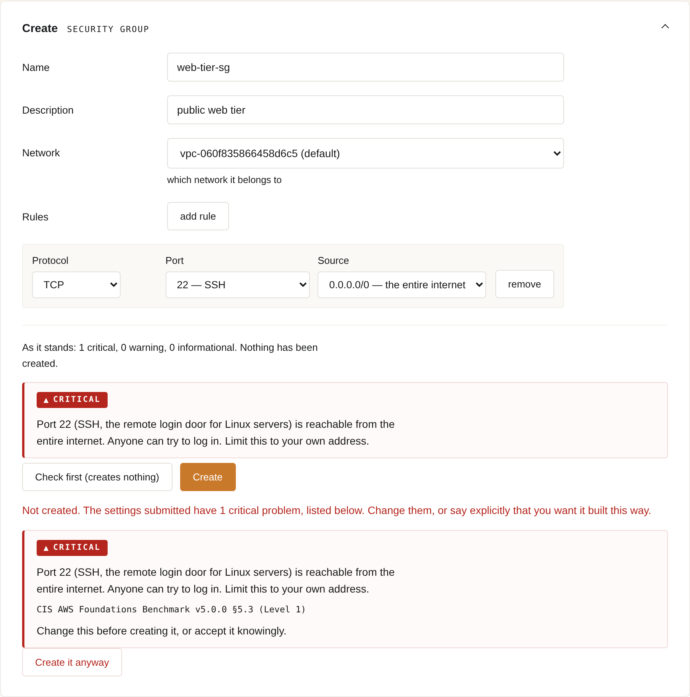
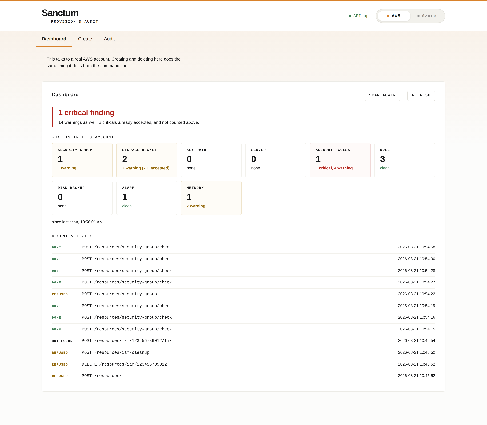

# Secure Cloud Provisioner

[](https://github.com/Hhhectic/secure-cloud-provisioner/actions/workflows/tests.yml)
[](LICENSE)
[](https://www.python.org/)

Provisions AWS and Azure resources through guided forms, and **refuses to create
anything with a critical security problem in it** until you either fix the
setting or say, explicitly, that you want it built that way anyway.

Most cloud security tools scan what already exists. By then the bucket has been
public for a week. This one puts the check *in front of* the create call, in
plain language, with the benchmark control it comes from — and still scans and
fixes what is already there.



The web interface is called **Sanctum**. There is a command-line runner with the
same capabilities, and an HTTP API underneath both.

---

## What it actually does

**Refuses bad configurations before they exist.** `POST /resources/{type}` runs
the same rules against the *submitted form* that the scanner runs against live
resources. A critical finding stops the create. Nothing is provisioned, so
there is nothing to clean up. Overriding is possible and deliberate — the create
has to be re-sent with `accept_risk=true`, which the page makes a separate
button, and the write is recorded in the audit log. There are legitimate reasons
to build something this tool disapproves of; being unable to is worse than being
warned.

**Scans what is already there, in English.** Findings say what is wrong and what
it means, not just which control failed:

> Port 22 (SSH, the remote login door for Linux servers) is reachable from the
> entire internet. Anyone can try to log in. Limit this to your own address.
>
> `CIS AWS Foundations Benchmark v5.0.0 §5.3 (Level 1)`

**Fixes what is safely fixable.** Findings that can be remediated carry a fix
action. The rest say why they cannot be.

**Builds a whole bastion architecture in one call.** `POST /blueprints/bastion`
creates a VPC with public and private subnets, two separate key pairs, two
security groups chained so the private host accepts SSH *only* from the
bastion's group, and the two instances. The security of a bastion isn't in any
one resource — it's in the relationships between six of them, which is exactly
what gets built wrong by hand. See
[docs/bastion-walkthrough.md](docs/bastion-walkthrough.md).

**Never downloads a private key from the cloud.** The page generates SSH key
pairs in the browser with WebCrypto and uploads only the public half — the tool
never calls `CreateKeyPair`. The private key goes straight to a download and
never crosses the network. Every instance it launches requires IMDSv2.

**Lets you accept a finding on the record.** An acknowledgement names one rule
ID exactly — no wildcards, because one pattern silencing a whole class of
finding is how these go wrong — and expires after 180 days. Acknowledged
findings keep their severity and their place in the list; they are counted
separately, never hidden.



## Resource types

Fifteen types, both clouds, behind one set of generic HTTP routes. Adding one is
a provider module, a rules module, and a single line in `api/registry.py` — no
route changes.

| AWS | Azure |
|---|---|
| Security group | Network security group |
| Storage bucket (S3) | Storage account |
| Key pair | Key vault |
| Server (EC2) | Virtual machine |
| Network (VPC) | Virtual network |
| Account access (IAM) | Monitoring |
| Role | |
| Disk backup (snapshot) | |
| Alarm (CloudWatch) | |

Rules are cited against the **CIS AWS Foundations Benchmark v5.0.0** and the
**AWS Startup Security Baseline**. A rule with no citation is not a defect —
several findings are ordinary good practice that no published benchmark covers,
and inventing a citation would be worse than leaving the field empty.

## Quick start

Python 3.12 or newer, and an AWS and/or Azure login. CI runs 3.12 and
development is on 3.14; nothing below 3.12 has been tried. Node is needed only
to run the frontend tests — **the page itself ships no dependencies**: no
bundler, no build step, no `npm install` to use it.

```bash
git clone https://github.com/Hhhectic/secure-cloud-provisioner.git
cd secure-cloud-provisioner
python -m venv .venv && source .venv/bin/activate
pip install -r requirements.txt
```

`requirements.txt` pulls in `backend/requirements.txt`, so that one command
installs both clouds. Install `backend/requirements.txt` alone if you only want
the AWS half.

Then put credentials in a `.env` at the repository root:

```bash
cp .env.example .env
```

Real environment variables always win over the file, so a shell export or a CI
secret overrides it without editing anything. Azure and AWS are independent — a
missing SDK or missing credentials costs you that cloud's tabs, not the page.

**Do not point this at an account until you have read [Before you run
it](#before-you-run-it) below.** The AWS login it needs is not your admin user;
[docs/iam-setup.md](docs/iam-setup.md) has the two least-privilege policy
documents and why AWS forces them to be two files.

### The web interface

```bash
cd backend && uvicorn api.app:app --reload --host 127.0.0.1
```

- <http://127.0.0.1:8000/ui> — Sanctum
- <http://127.0.0.1:8000/docs> — interactive OpenAPI, which will drive every
  endpoint with no frontend involved

### The command line

```bash
cd backend && python main.py
```

Same five-step menu for every resource type: create, list, audit, fix, clean up.

## Before you run it

This is a tool that holds cloud credentials and deletes things. Read this part.

**No authentication, localhost only.** The server binds to `127.0.0.1` on
purpose and has no login screen. Adding one to a process that already trusts
whoever is sitting at the machine would be theatre — but it means **putting this
on a public interface hands your cloud account to the internet.** Don't.

**Deleting requires naming the thing twice.** Every destructive route makes you
repeat the resource's own ID in a `confirm` parameter, and answers a
`GET .../deletion-plan` first that says what else goes with it. A caller that
forgets gets a 400 with the plan in it rather than a deletion.

**Cleanup deletes by tag, not by author.** The bulk cleanup and
`scripts/make_vulnerable.py --clean` destroy everything carrying the tool's tag
in the target region — including resources a teammate created. If you share an
account, give each person their own region; `--region` is supported everywhere.

**`scripts/make_vulnerable.py` creates genuinely insecure resources** so you can
watch the scanner find them. It is a demo fixture. Only run it somewhere you do
not mind being wrong for a few minutes, and clean up after.

**Writes are logged.** Every write goes to `~/.secure-cloud-provisioner/audit.log`
with the method, path, and outcome. `SCP_AUDIT_LOG` moves it. Reads are not
logged — scanning is the safe half, and recording it would bury the lines that
matter.

## How it is checked

```bash
cd backend && pytest                 # 1041 tests, no cloud account needed
cd frontend && npm install && npm test
```

The Python suite runs against [moto](https://github.com/getmoto/moto), which
fakes AWS in memory, and `scanner/` has no cloud SDK in it at all — which is why
CI can run the whole thing on a pull request from a fork with no credentials.

**That is also its limit, and the limit is documented rather than glossed.**
moto has disagreed with real AWS more than once in this project: it permits
buckets with no encryption, which AWS has not allowed since January 2023, and it
enforces `aws:SecureTransport` over its own plain-HTTP endpoint, which real
boto3 never triggers. Green tests here do not prove the tool works.

- `python scripts/smoke_test.py` is the answer to that — end to end against a
  real account, including whether the IAM policy actually grants what the tool
  needs, which moto structurally cannot check. It is deliberately not run in CI.
- [docs/benchmark.md](docs/benchmark.md) is the other answer: this tool run
  against the same account as **Prowler 5.37.1** (281 checks), with the findings
  compared three ways — where they agree, what Prowler caught that this misses,
  and what this caught that Prowler missed. The gaps are listed, not hidden. Two
  apparent gaps turned out not to be, and that is written up too, as a caution
  about reading a diff too quickly.

The frontend tests run `keygen.js` unmodified under Node and hand the result to
`ssh-keygen` — if the OpenSSH byte layout, padding, or check integers were
wrong, `ssh-keygen` would reject the key. CI fails the build if those tests
silently skip.

## Layout

```
backend/
  main.py            command-line runner
  api/app.py         HTTP routes, generic across every resource type
  api/registry.py    the seam: one adapter block per resource type
  aws/  az/          provider modules, one per resource type
  scanner/           the rules. No cloud SDK imports, ever
  blueprints/        multi-resource architectures (bastion)
  scripts/           smoke test, CloudWatch harness, demo fixture
  tests/
frontend/            plain HTML, CSS and two scripts. No build step
docs/                IAM setup, bastion walkthrough, Prowler benchmark
archive/             two earlier Streamlit interfaces, kept, not wired up
```

The reason `scanner/` imports no cloud SDK is the thing to understand first:
every rule takes a plain settings dict and returns the same warning shape
regardless of resource or cloud. That is what lets one set of HTTP routes serve
fifteen resource types, and what makes the rules testable without an account.

[docs/development-log.md](docs/development-log.md) is the working log the project
was built from — design arguments, dead ends, and every place moto disagreed with
real AWS. It is a log, not documentation; where it and the code disagree, the
code is right.

## Contributing

See [CONTRIBUTING.md](CONTRIBUTING.md). Security rules are the part to be
careful with — a rule that fails open is worse than no rule, so new ones need a
test that fails without them.

To report a vulnerability, see [SECURITY.md](SECURITY.md).

## License

MIT. See [LICENSE](LICENSE).

This began as a capstone project and is a learning tool, not an audited security
product. It checks a specific, documented set of controls; passing it does not
mean an account is secure. Use it alongside your cloud provider's own tooling.
